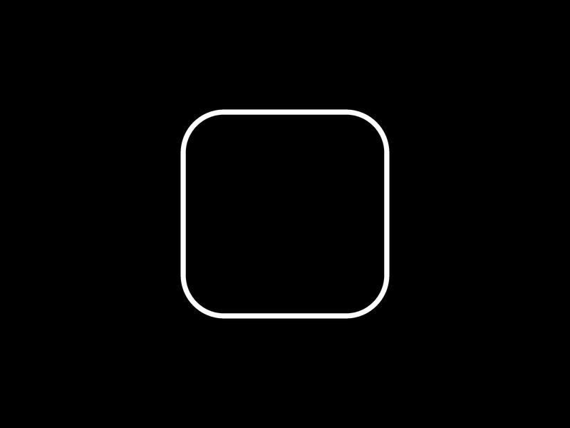

# Shape Lens Blur Effect with SDFs and WebGL

*An introduction on harnessing the power of Signed Distance Fields (SDFs) to draw shapes with interactive lens blur effect.*

[Article on Codrops](https://tympanus.net/codrops/?p=77970)

[Demo](http://tympanus.net/Tutorials/SDFLensBlur/)

## Installation

- Install with `npm install`
- Run demo with `npm run dev`
- Build with `npm run build`

## Credits
- [Three.js](https://threejs.org/) - WebGL Library
- [Inigo Quilez's Articles](https://iquilezles.org/articles/distfunctions2d/) - 2D distance functions
- [The Book of Shaders](https://thebookofshaders.com/) - Shaders learning resources
- [Lygia](https://lygia.xyz/) - Shader Library

## Misc

Follow *Guillaume Lanier*: [X](https://x.com/guilanier), [GitHub](https://github.com/guilanier) 

Follow Codrops: [X](http://www.X.com/codrops), [Facebook](http://www.facebook.com/codrops), [GitHub](https://github.com/codrops), [Instagram](https://www.instagram.com/codropsss/)

## License
[MIT](LICENSE)

Made with :blue_heart:  by [Codrops](http://www.codrops.com)

